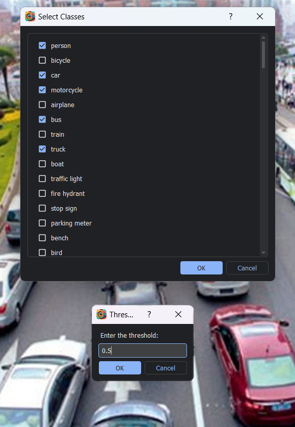

<div align = "center">
<h1>
    
<br>
Labelmm 
</h1>

<h3>
Auto Annotation Tool for Computer Vision Tasks
</h3>

Labelmm makes the next generation of annotation tools. integrates the power of SOTA models from mmdetection in Computer vision to <a href = "https://github.com/wkentaro/labelme">Labelme</a>


[](https://github.com/open-mmlab/mmdetection/tree/2.x)
[](https://github.com/0ssamaak0/labelmm/blob/master/LICENSE)


<!-- make p with larger font size -->
[Installation](#installation----)  🛠️ | [Input Modes](#Input-Modes----) 🎞️ | Model Selection 🤖 | Inferece Options ⚙️ | Object Tracking 🚗 | Export 📤
</div>

# Installation 🛠️
## 1. Install [Pytorch](https://pytorch.org/)
preferably using anaconda

create conda virtual environment and install pytorch 

```
conda create --name labelmm python=3.8 -y
conda activate labelmm

conda install pytorch==1.13.1 torchvision==0.14.1 torchaudio==0.13.1 pytorch-cuda=11.7 -c pytorch -c nvidia
```
## 2. install requirements

```
pip install -r requirements.txt
mim install mmcv-full==1.7.0
```

### Solutions to possible problems
<details>

<summary>click to expand </summary>

#### 1. (linux only 🐧) 
some linux machines may have this problem 
```
Could not load the Qt platform plugin "xcb" in "/home/<username>/miniconda3/envs/test/lib/python3.8/site-packages/cv2/qt/plugins" even though it was found.
This application failed to start because no Qt platform plugin could be initialized. Reinstalling the application may fix this problem.

Available platform plugins are: xcb, eglfs, linuxfb, minimal, minimalegl, offscreen, vnc, wayland-egl, wayland, wayland-xcomposite-egl, wayland-xcomposite-glx, webgl.
```
it can be solved simply be installing opencv-headless
```
pip3 install opencv-python-headless
```
#### 2. (windows only 🪟)
some windows machines may have this problem when installing **mmdet**
```
Building wheel for pycocotools (setup.py) ... error
...
error: Microsoft Visual C++ 14.0 or greater is required. Get it with "Microsoft C++ Build Tools": https://visualstudio.microsoft.com/visual-cpp-build-tools/
```
You can try
```
conda install -c conda-forge pycocotools
```
or just use Visual Studio installer to Install `MSVC v143 - VS 2022 C++ x64/x86 build tools (Latest)**`

</details>


# Input Modes 🎞️

labelmm provides 3 Input modes:

- **Image** : for image annotation
- **Directory** : for annotating images in a directory
- **Video** : for annotating videos


# Model Selection 🤖
For model selection, Labelmm provides the **Model Explorer** to utilize the power numerous models of [mmdetection](https://github.com/open-mmlab/mmdetection/tree/2.x) and [ultralytics YOLOv8](https://github.com/ultralytics/ultralytics) the to give the user the ability to compare, download and select his library of models


for Object Tracking, Labelmm offers 5 different tracking models with the ability to select between them


# Inferece Options ⚙️
Labelmm provides inference options such as Threshold selection and Class Selection (80 COCO classes)




# Object Tracking 🚗
In Object Detection, Labelmm provides seamless expirence for video navigation, tracking settings and different visualization options with the ability to export the tracking results to a video file

Beside this, Labelmm provides a completely new way to modify the tracking results, including edit and delete propagation across frames and different interpolation methods


# Export 📤
For Instance Segmentation, Labelmm provides to option to export all input modes to COCO format
while for Object Detection on videos, Labelmm provides the ability to export the tracking results to MOT format


# Running

```
cd labelme-master
python __main__.py
```

# Resources
- [Labelme](https://github.com/wkentaro/labelme)
- [MMDetection](https://github.com/open-mmlab/mmdetection/tree/2.x)
- [ultralytics YOLOv8](https://github.com/ultralytics/ultralytics)
- [mikelbrostrom yolov8_tracking](https://github.com/mikel-brostrom/yolov8_tracking)