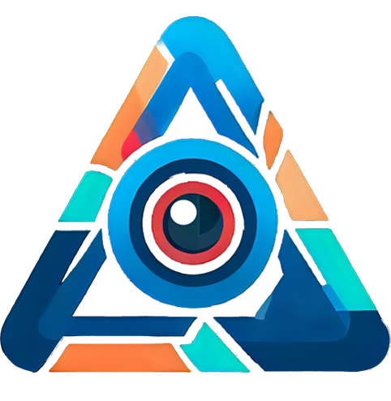

<div align = "center">
<h1>
    
<br>

</h1>

<h3>
Data Labeling, Tracking and Annotation with AI
</h3>

DLTA-AI is the next generation of annotation tools, integrating the power of Computer Vision SOTA models to <a href = "https://github.com/wkentaro/labelme">Labelme</a> in a seamless expirence and intuitive workflow to make creating image datasets easier than ever before

<h3>
Auto Annotation Tool for Computer Vision Tasks
</h3>

[](https://pytorch.org/)
[](https://pytorch.org/)
[](https://github.com/open-mmlab/mmdetection/tree/2.x)
[](https://github.com/0ssamaak0/DLTA-AI/blob/master/LICENSE)
[](https://github.com/0ssamaak0/DLTA-AI/releases)
[](https://github.com/0ssamaak0/DLTA-AI/issues)
[](https://github.com/0ssamaak0/DLTA-AI/commits)

<br>


<br>

<!-- make p with larger font size -->
[Installation](#installation-%EF%B8%8F)  🛠️ | [Segment Anything](#Segment-Anything-) 🪄 | [Input Modes](#input-modes-%EF%B8%8F) 🎞️ | [Model Selection](#model-selection-) 🤖 | [Segmentation](#segmentation-) 🎨 | [Object Tracking](#object-tracking-) 🚗 | [Export](#export-) 📤 | [Other Features](#other-features-) 🌟| [Contributing](#contributing-) 🤝| [Acknowledgements](#acknowledgements-)🙏| [Resources](#resources-) 🌐 | [License](#license-) 📜

</div>


# Installation 🛠️
## Full Insallation
after downloading the lastest [release](https://github.com/0ssamaak0/DLTA-AI/releases) or cloning the repoistory, do the following steps
### 1. Install [Pytorch](https://pytorch.org/)
preferably using anaconda

```
conda create --name DLTA-AI python=3.8 -y
conda activate DLTA-AI

conda install pytorch==1.13.1 torchvision==0.14.1 torchaudio==0.13.1 pytorch-cuda=11.7 -c pytorch -c nvidia
```
### 2. install requirements

```
pip install -r requirements.txt
mim install mmcv-full==1.7.0
```
### 3. Running
Run the tool from `DLTA-AI-app` directory
```
cd labelme-master
python __main__.py
```
### Solutions to possible problems
<details>

<summary>click to expand </summary>

#### 1. (linux devices 🐧) 
some linux machines may have this problem 
```
Could not load the Qt platform plugin "xcb" in "/home/<username>/miniconda3/envs/test/lib/python3.8/site-packages/cv2/qt/plugins" even though it was found.
This application failed to start because no Qt platform plugin could be initialized. Reinstalling the application may fix this problem.

Available platform plugins are: xcb, eglfs, linuxfb, minimal, minimalegl, offscreen, vnc, wayland-egl, wayland, wayland-xcomposite-egl, wayland-xcomposite-glx, webgl.
```
it can be solved simply be installing opencv-headless
```
pip3 install opencv-python-headless
```
#### 2. (windows devices 🪟)
some windows machines may have this problem when installing **mmdet**
```
Building wheel for pycocotools (setup.py) ... error
...
error: Microsoft Visual C++ 14.0 or greater is required. Get it with "Microsoft C++ Build Tools": https://visualstudio.microsoft.com/visual-cpp-build-tools/
```
You can try
```
conda install -c conda-forge pycocotools
```
or just use Visual Studio installer to Install `MSVC v143 - VS 2022 C++ x64/x86 build tools (Latest)**`

</details>

## 2. Executable (CPU only)
you can download the executable from the [releases](https://github.com/0ssamaak0/DLTA-AI/releases) according to your OS and run it directly

however, Executables doesn't support GPU
# Segment Anything 🪄 (NEW)
DLTA-AI takes the Annotation to the next level by integrating lastest Meta models [Segment Anything (SAM)](https://github.com/facebookresearch/segment-anything) to support zero-shot segmentation for any class

**SAM** can be used also to improve the quality of Segmentation, even inaccurate polygons around the object is enough to be segmented correctly

**SAM** doesn't only work for Segmentation tasks, it's build in the video mode to support **Object Tracking** as well for any class


# Input Modes 🎞️

DLTA-AI provides 3 Input modes:

- **Image** : for image annotation
- **Directory** : for annotating images in a directory
- **Video** : for annotating videos

each mode has its own settings and options, and the user can switch between them easily


# Model Selection 🤖
For model selection, DLTA-AI provides the **Model Explorer** to utilize the power of the numerous models in [mmdetection](https://github.com/open-mmlab/mmdetection/tree/2.x) and [ultralytics YOLOv8](https://github.com/ultralytics/ultralytics) as well as the models of [SAM](https://github.com/facebookresearch/segment-anything)

the to give the user the ability to compare, download and select from the library of models


# Segmentation 🎨
Using the models from the **Model Explorer**, DLTA-AI provides a seamless expirence to annotate single image or batch of images, with options to select classes, modify threshold, and full control to edit the segmentation results.


and as mentioned before, **SAM** is fully integrated in DLTA-AI to provide zero-shot segmentation for any class, and to improve the quality of segmentation

# Object Tracking 🚗
Built on top of the segmentation and detection models, DLTA-AI provides a complete solution for Object Tracking, with 5 different models for tracking

To impr DLTA-AI have options for video navigation, tracking settings and different visualization options with the ability to export the tracking results to a video file

Beside this, DLTA-AI provides a completely new way to modify the tracking results, including edit and delete propagation across frames


Beside automatic tracking models, DLTA-AI provides different methods of interpolation and filling gaps between frames to fix occlusions and unpredicted behaviors in a semi-automatic way


# Export 📤
For Instance Segmentation, DLTA-AI provides to option to export the segmentation to standard COCO format, and the results of tracking to MOT format, and a video file for the tracking results with desired visualization options e.g., show id, bbox, class name, etc.


DLTA-AI provides also the ability to add user-defined or custom export formats that can be used for any purpose, once the user defines his own format, it will be available in the export menu.

# Other Features 🌟

- Threshold Selection (Confidence and IoU)
- Select Classes (from 80 COCO classes)
- Track assigned objects only
- Merging models (Run both models and merge the results)
- Show Runtime Type (CPU/GPU)
- Show GPU Memory Usage
- Video Navigation (Frame by Frame, Fast Forward, Fast Backward, Play/Pause)
- Light / Dark Theme Support (syncs with OS theme)
- Fully Customizable UI (drag and drop, show/hide)
- OS Notifications (for long running tasks)
- using orjson for faster json serialization
- additional script (external) to evaluate the results of segmentation (COCO)
- additional script (external) to extract frames from a video file for future use


# Contributing 🤝
DLTA-AI is an open source project and contributions are very welcome, specially in this early stage of development.

you can contribute by:
- Create an [issue](https://github.com/0ssamaak0/DLTA-AI/issues) Reporting bugs 🐞 or suggesting new features 🌟 or just give your feedback 📝

- Create a [pull request](https://github.com/0ssamaak0/DLTA-AI/pulls) to fix bugs or add new features, or just to improve the code quality, optimize performance, documentation, or even just to fix typos

- Review [pull requests](https://github.com/0ssamaak0/DLTA-AI/pulls) and help with the code review process

- Spread the word about DLTA-AI and help us grow the community 🌎, by sharing the project on social media, or just by telling your friends about it

# Acknowledgements 🙏
This tool is part of a Graduation Project at [Faculty of Engineering, Ain Shams University](https://eng.asu.edu.eg/) under the supervision of:

- [Dr. Karim Ismail](karim.ismail@carleton.ca)
- [Dr. Ahmed Osama](ahmed.osama@eng.asu.edu.eg)
- Dr. Watheq El-Kharashy
- [Eng. Yousra El-Qattan](https://www.linkedin.com/in/youssra-elqattan/)

we want also to thank our friends who helped us with testing, feedback and suggestions:

- Eng. Houssam Siyoufi
- [Amin Mohamed](https://github.com/AminMohamed-3)
- [Badr Mohamed](https://github.com/Badr-1)
- [Ahmed Mahmoud](https://github.com/ahmedd-mahmoudd)
- [Youssef Ashraf](https://github.com/0xNine9)
- [Chadi Ashraf](https://github.com/Chady00)


# Resources 🌐
- [Labelme](https://github.com/wkentaro/labelme)
- [Segment Anything (SAM)](https://github.com/facebookresearch/segment-anything)
- [MMDetection](https://github.com/open-mmlab/mmdetection/tree/2.x)
- [ultralytics YOLOv8](https://github.com/ultralytics/ultralytics)
- [mikelbrostrom yolov8_tracking](https://github.com/mikel-brostrom/yolov8_tracking)
- [orjson](https://github.com/ijl/orjson)
- [icons8](https://icons8.com/)

# License 📜
DLTA-AI is released under the [GPLv3 license](https://github.com/0ssamaak0/DLTA-AI/blob/master/LICENSE). 
